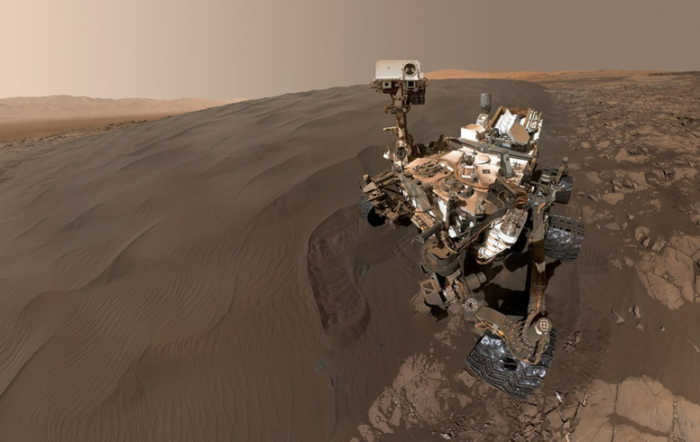
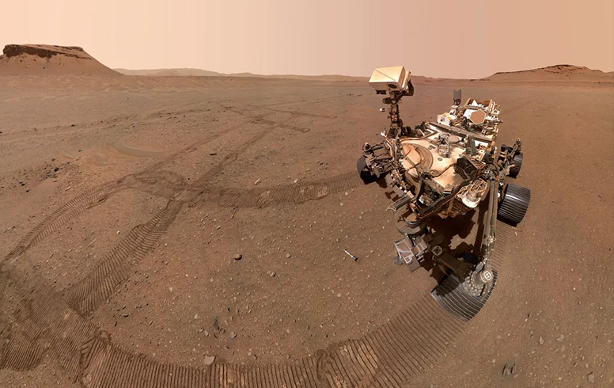
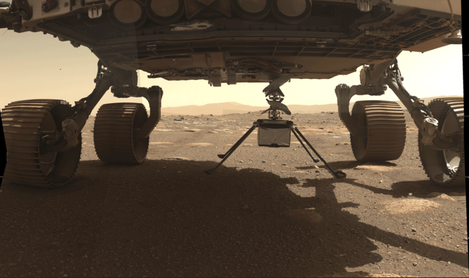
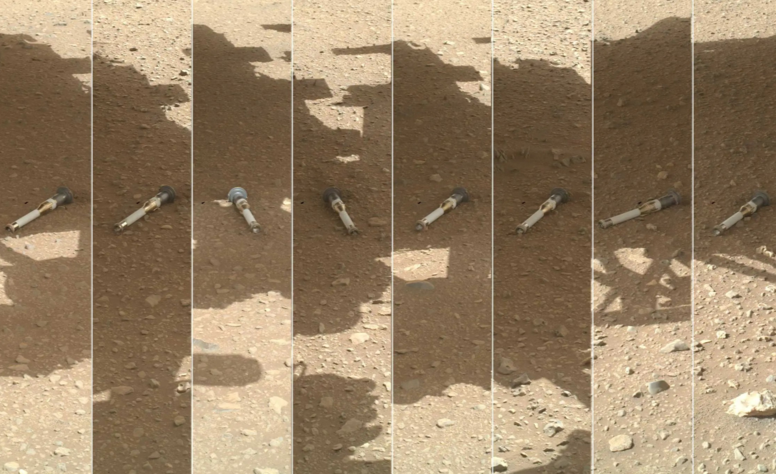

# MRM - Mars Rovers Monitor
This repo runs a simple script capturing the waypoint data of NASA's Mars rover missions Curiosity and Perseverance. <br>
The data from the latest run, along with the differences from the previous run, are published [here](https://kkoshy.github.io/mars-rover-monitor/).

## MRM - Trace data
The following files show the complete set of waypoints traced by the corresponding mission.<br>
- [curiosity_rover_data.json](https://kkoshy.github.io/mars-rover-monitor/curiosity_rover_data.html)
- [ingenuity_copter_data.json](https://kkoshy.github.io/mars-rover-monitor/ingenuity_copter_data.html)
- [perseverance_rover_data.json](https://kkoshy.github.io/mars-rover-monitor/perseverance_rover_data.html)
- [sample_tubes_data.json](https://kkoshy.github.io/mars-rover-monitor/sample_tubes_data.html)

## MRM - New data
The following files show the new waypoints data in the last 24 hours.<br>
- [new_curiosity_rover_data.json](https://kkoshy.github.io/mars-rover-monitor/new_curiosity_rover_data.html)
- [new_ingenuity_copter_data.json](https://kkoshy.github.io/mars-rover-monitor/new_ingenuity_copter_data.html)
- [new_perseverance_rover_data.json](https://kkoshy.github.io/mars-rover-monitor/new_perseverance_rover_data.html)
- [new_sample_tubes_data.json](https://kkoshy.github.io/mars-rover-monitor/new_sample_tubes_data.html)

## MRM - Local
Locally, the complete trace data for each mission could be obtained.
MRM is built with [graphene-django](https://docs.graphene-python.org/projects/django/en/latest/) which helps to use GraphQL queries for analysis.<br>
Packages required for running MRM could be installed using,<br>

```commandline
pip install -r requirements.txt
```
Run MRM and generate the trace data using the command,

```commandline
python mars_rover_missions.py
```
To load the data and analyse using GraphQL, execute the following commands,
```commandline
python manage.py makemigrations rovers
```
```commandline
python manage.py migrate rovers
```
```commandline
python manage.py migrate --run-syncdb
```
```commandline
python manage.py loaddata curiosity_rover_data
```
```commandline
python manage.py loaddata ingenuity_copter_data
```
```commandline
python manage.py loaddata perseverance_rover_data
```
```commandline
python manage.py loaddata sample_tubes_data
```
```commandline
python manage.py runserver
```
Now to interact with the locally created database, click [here](http://localhost:8000/graphql)

## What is Curiosity?
NASA's Curiosity rover is a robotic, car-sized vehicle deployed as part of the Mars Science Laboratory (MSL) mission, which aims to investigate whether Mars had conditions suitable for supporting microbial life in the past.<br>
Curiosity is equipped with a suite of scientific instruments, including cameras, a robotic arm with specialized laboratory-like tools, and other equipment, to analyze the Martian soil and rocks. <br>
Landing location: Mount Sharp -> Gale Crater



## What is Perseverance?
NASA's "Perseverance" refers to the Mars 2020 mission's rover, designed to explore the Jezero Crater, searching for signs of past microbial life. <br>
The rover is collecting core samples of Martian rock and regolith (broken rock and soil), for potential pickup by a future mission that would bring them to Earth for detailed study.<br>
Landing location: Jezero Crater(Showed signs of a large lake and river delta)<br>



## What is Ingenuity?
NASA's "Ingenuity" refers to the Ingenuity Mars Helicopter, a small, lightweight helicopter that flew to Mars attached to the belly of the Perseverance rover, making history as the first powered, controlled flight on another planet.<br>
Ingenuity was designed as a technology demonstration, aiming to prove that powered, controlled flight is possible on Mars, a challenging environment with a thin atmosphere and low gravity. <br>
It scouts ahead for the rover, exploring the Martian landscape. <br>
Note: After 72 successful flights over nearly 3 years, Ingenuity's mission ended on January 18, 2024, when it was discovered to have a damaged rotor blade. 



## What is Mars Sample Return?
Mars Sample Return (MSR) campaign, a joint effort with the European Space Agency (ESA) aimed at bringing carefully selected samples of Martian rocks, soils, and atmosphere back to Earth for detailed analysis.<br>
This includes,<br>
- Sample Collection: The Perseverance rover is collecting samples on Mars, which are stored in tubes. (current)<br>
- Sample Retrieval: A Sample Retrieval Lander will land on Mars to retrieve the cached samples, utilizing a Mars Ascent Vehicle to launch the samples into orbit. (future)<br>
- Sample Return: ESA's Earth Return Orbiter will then bring the samples back to Earth. (future)<br>



## Official Documentation

Link for NASA's official [Mars exploration site](https://science.nasa.gov/planetary-science/programs/mars-exploration)

## Reach out

You have reached the end of this document.<br>
Thank you for your patience.<br>
If you have any questions, feedback, or suggestions, feel free to reach out.<br>

- 📧 Email: [kamalikoshy97@gmail.com](mailto:kamalikoshy97@gmail.com)  


